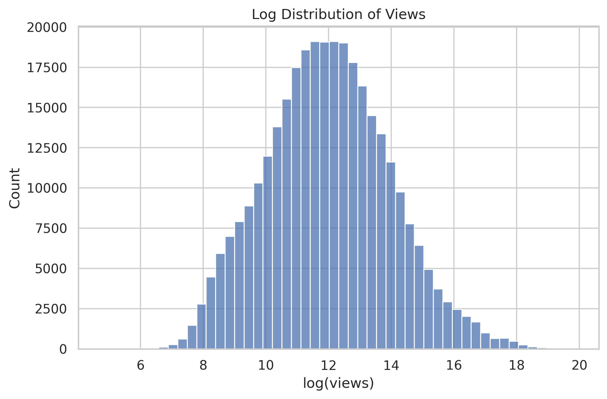
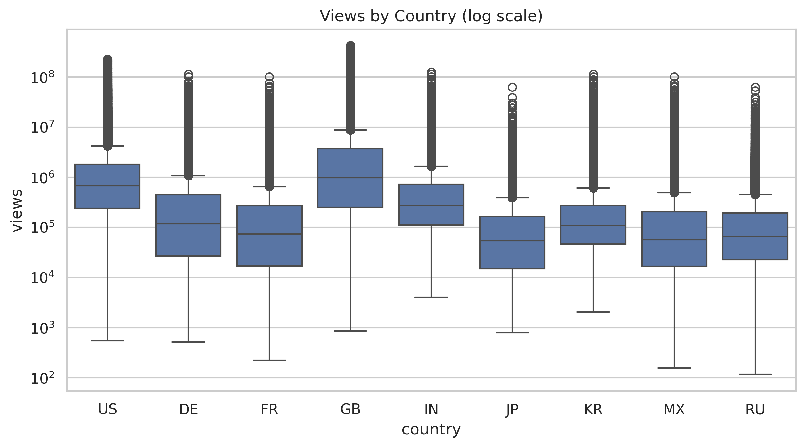
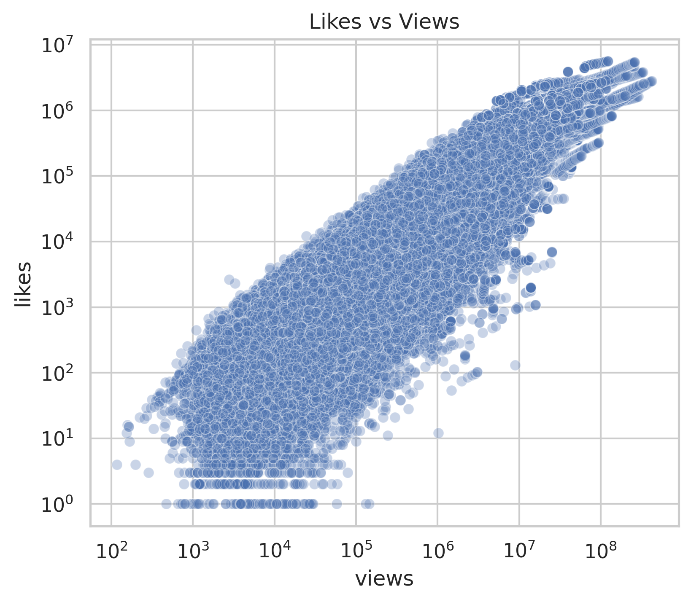
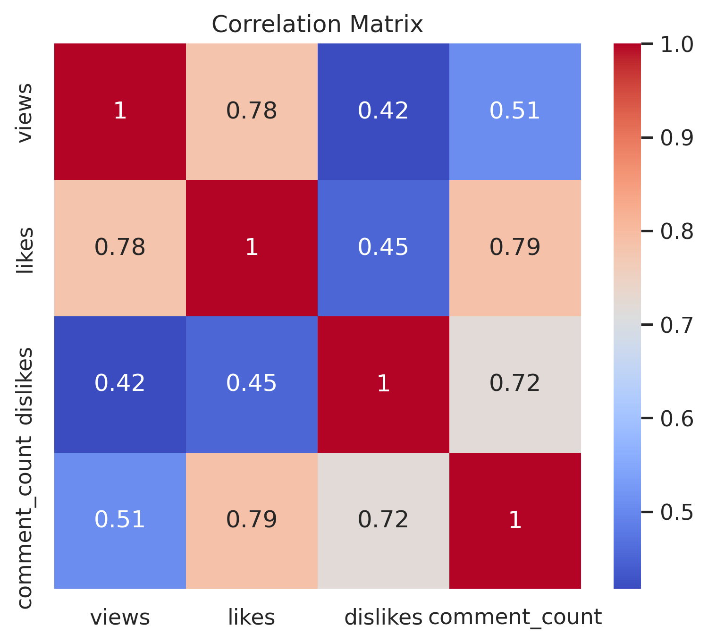
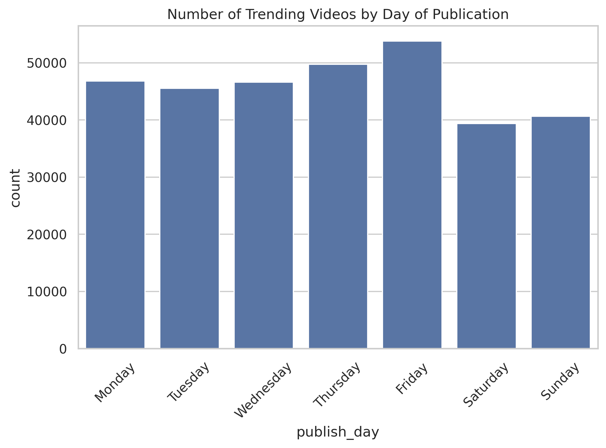
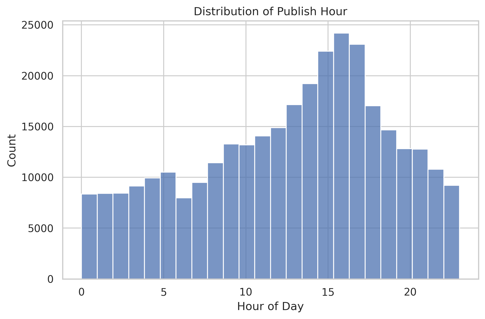

# Project of Data Visualization (COM-480)

## Milestone 1 (20th March, 5pm)

**10% of the final grade**

This is a preliminary milestone to let you set up goals for your final project and assess the feasibility of your ideas.
Please, fill the following sections about your project.

*(max. 2000 characters per section)*

### Dataset

### Problematic

### Exploratory Data Analysis

We merged all country datasets into a single dataframe by adding a country identifier. During loading, some datasets (Japan, South Korea, Mexico, and Russia) had encoding issues, which we handled using UTF-8 with error replacement. Since only a small number of rows were affected, we kept them.

We then performed preprocessing: converting dates to a proper datetime format (accounting for the non-standard trending date), removing duplicates, and filling missing descriptions with a placeholder, as this variable is not critical.

We also engineered additional features, including publication hour, day of the week, and days to trending.

Below is a simple exploratory data analysis. For more details, see the `milestone1` notebook.

---

#### Distribution of Views (Log Scale)

Views are highly skewed, with a few videos receiving extremely high values. The log transformation makes the distribution more symmetric, confirming a heavy-tailed behavior.

---

#### Distribution of Views by Country (Log Scale)

The skewness is consistent across countries, with slight differences in spread, reflecting variations in content popularity.

---

#### Relationship Between Views and Likes

There is a strong positive relationship between views and likes, showing that more viewed videos generate more engagement.

---

#### Correlation Between Engagement Metrics

Views, likes, and comment count are strongly correlated, indicating that popular videos generate high interaction across metrics.

---

#### Publication Day

Videos are more frequently published on weekdays, with a peak around Thursday and Friday.

---

#### Publication Hour

Most videos are published in the afternoon and early evening, especially between 14:00 and 18:00.

#### Days to Trending

Most videos reach trending quickly, usually within 0-2 days. The distribution is skewed, with a few extreme values considered outliers.

### Related work

